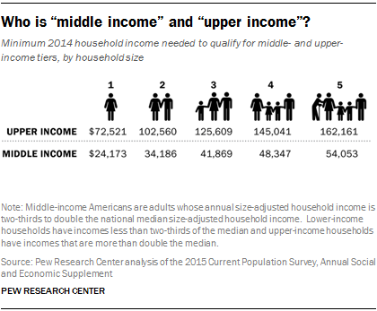
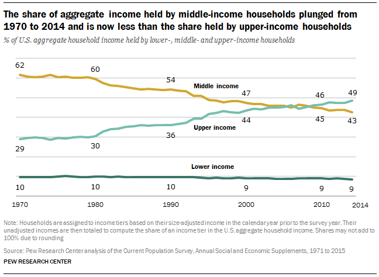
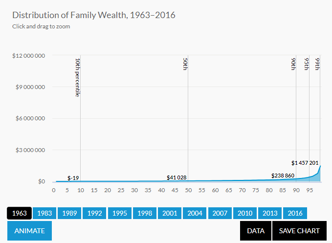
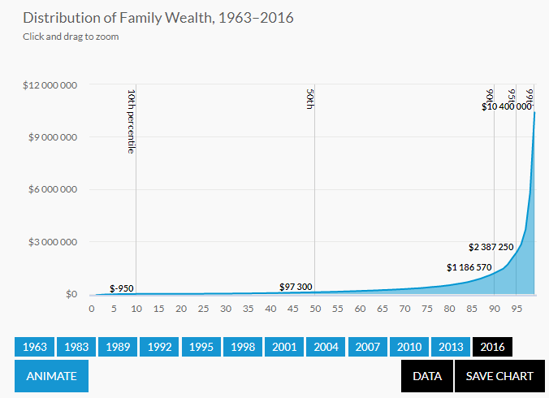
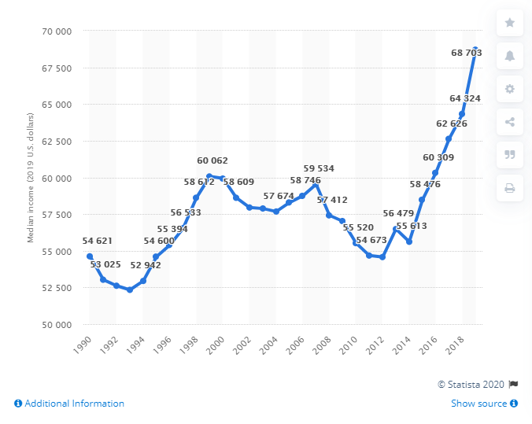

## The Growing Inequality of Income & Wealth in the US

I have become curious recently to learn more about the growing financial inequality (in both income & wealth) that has been occuring in the US over the past 50 years. I have summarized my search here with links to some of the clearest explanations along with some excerpted graphics and quotes.

### Rising inequality from 1970-2000
From [Wikipedia](https://en.wikipedia.org/wiki/Middle_class):

> During the height of the American Middle Class, in the 1950s and 1960s low income workers reaped the benefits of a growing economy. The jobs created were ideal blue collar positions that paid well and strengthened the backbone of the American economy. Jordan Weismann at The Atlantic writes, “The poorest fifth of all households, in fact, fared best. Then, in the 1970s, amid two oil crises and awful inflation, things ground to a halt. The country backed off the postwar, center-left consensus -- captured by Richard Nixon's comment that "we're all Keynesians now"—and tried Reaganism instead. We cut taxes. Technology and competition from abroad started whittling away at blue collar jobs and pay. The financial markets took off.” Based on a 2012 study by Pew Research Center that looked at the average annual change in mean family income between 1950 and 2010, the middle class peaked in the 1970s. By the start of the 1980s the poorest fifth of all households was no longer receiving the lion’s share of the spoils and in fact saw their mean family income decline between 1980-1990. In that same time frame the uppermost quintile saw their mean income increase by just over 2% and the top 5% of earners by over 3%. Those numbers grew to 3% and 4% respectively in the 1990s, while middle and lower class income growth lagged behind with a mild 1% growth.

### The American Middle Class is Losing Ground
From [PEW research: The American Middle Class Is Losing Ground](https://www.pewsocialtrends.org/2015/12/09/the-american-middle-class-is-losing-ground/):

> The hollowing of the American middle class has proceeded steadily for more than four decades. Since 1971, each decade has ended with a smaller share of adults living in middle-income households than at the beginning of the decade, and no single decade stands out as having triggered or hastened the decline in the middle.

### Wealth Inequality in America Over Time
From [Wealth Inequality is Growing](https://apps.urban.org/features/wealth-inequality-charts/):

> Average wealth has increased over the past 50 years, but it has not grown equally for all groups.  
> Between 1963 and 2016:
> - families near the bottom of the wealth distribution (those at the 10th percentile) went from having no wealth on average to being about $1,000 in debt,
> - those in the middle more than doubled their wealth,
> - families near the top (at the 90th percentile) saw their wealth increase fivefold,
> - and the wealth of those at the 99th percentile—in other words, those wealthier than 99 percent of all families—grew sevenfold.

### Median by year
From [Median household income in the United States from 1990 to 2019](https://www.statista.com/statistics/200838/median-household-income-in-the-united-states/):

