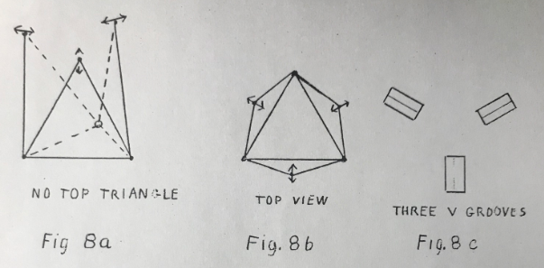

## STRONG LIGHTWEIGHT STRUCTURES

This has to do with three dimensional structures but first we will start
with some of the simpler two dimensional ones. Take the case of a simple beam
supporting a load at its certer, Figure 1.

The beam will be bent by the load. We
can calculate how much if we know a number of things about the set up, specifically
the length, the load, the material of the beam, and the geometry, particularly of
the shape of the cross section. The general formula is 
> S = (F\*L^3) / (4\*M\*A^3\*B)

where L is the length, F is the load, A & B are the dimensions of the assumed rectangular cross section, M is the modulus of elasticity, and S is the amount of bend.

Note that the expression contains a part A^3*B which is similar to that
for the moment of inertia of the cross section so it is common to speak of the
moment of inertia of the cross section as the shape factor that affects the stiffness.

This shows, and we all know it instinctively that the deeper the beam the
stiffer it will be for a given amount of material. Thus we have the common I beam
section where nearly all of the material of the beam is  concentrated at top and
bottom. Material may be further economized by tapering the bar towards the ends.

Now let's separate top and bottom farther and we will get a truss like
Figure 2.

The moment of inertia at the center of the beam is now very much greater.
We have also tapered the structure to the ends and so have reduced the moment at
the ends where the bending load is less.

This is a simple bar structure. The significant thing is that all the bars
are either in **tension** or in **compression**, assuming perfect free joints of course.
There are **no forces tending to bend any bar** in the structure. The deflection due to
the load can be calculated from a set of simultaneous equations derived from the
geometry and the elasticity of the bars. Note that the two sloping bars to the load
are in tension and the horizontal one is in compression. The amount of stretch
or compression can be calculated and so the thickness of the bars can be selected
for maximum use of material. Note that the structure has 3 joints and 3 bars.

Figure 3 shows an added vertical bar.

A little thought shows that it 
contributes practically nothing to the stiffness of the beam. This is because the
long upper bar has very little resistance to bending. This vertical bar should be
left out, unless possibly it is very thin and used to stop vibration of the long
upper bar. We say that a structure such as this has a **redundant** bar.

Figure 4 however shows a structure where a vertical bar is essential and
we have the familiar diamond truss. It has 5 bars and 4 joints.

Figure 5 shows a variation of the 5 bar diamond truss. Dotted across the
top is a possible position for a 6th bar. This example is to show the important
case where the structure nas a redundant bar and is **overstiff**. This means that the
structure was stiff or self supporting before the extra bar was added. The important
thing is that if any of the 5 bars in the original structure were to expand or contract
due to temperature changes for example, the structure will experience no forces due
to this change. It will merely change its shape slightly. Similarity if a mistake
is made in any of the lengths, the structure will still go together without strain
(if we assume of course perfectly flexible joints). But the extra 6th bar spoils
this. If it does not fit in any way the whole frame will be in stress before any
useful load is applied and so the frame will fail at lower loads than expected all
because we have tried to help in the wrong way.

The other error we can make is to leave out a member. If any one of the
5 bars of Figure 4 or Figure 5 are omitted the structure is useless. It turns out
that for a **just stiff** structure - no redundant bars and no omitted bars - the number
of joints and number of bars are related by the simple rule - multiply the number
of joints by 2 and subtract 3 to get the correct number of bars. Check it on the
structures described.

> 2D Rule:  
> Number of bars = 2 x Number of joints - 3

Now we will leave the simple plane figures and get into the really
interesting 3 dimensional structures of real life.

Probably the simplest one to start with is the tripod - anyway we are
Kodak people so let's be photogenic if you will.

The tripod has a job to do. It must support the camera at a given **place**
and hold it **pointing properly**. The given place involves three positional coordinates,
X, Y and Z for example. The "pointing properly" involves three angular coordinates,
pitch, yaw, and roll, in nautical terms. This means that a good tripod, in
addition to determining a point in space, must also supply a platform in space.
This means 3 positional coordinates and 3 angular cocrdinates.

Now how many legs does a good tripod have? My experience is that probably
97% of us will answer 3 of course.

Now let's try it out in a model - a space diagram. For this use what we
know as "D stix" or "think stix". They are sold by the Edmond Scientific Co. in
Barrington, New Jersey and consist of 1/8=inch dowels of various lengths and colors
and, most important, flexible couplings to form the joints.

For our tripod we will connect three sticks to form a triangle for a base
then at each corner connect a bar. Join the three bars at the top and we nave a three
legged tripod. But we have no platform. The camara will, it is true, be held at a
fixed point in space but will wobble all around. True we can somehow fix the camera
to the top, but the thin legs will bend and let the camera tilt around. This is a
familiar experience if you try to make telephoto pictures using a cheap three-legged
tripod.

We must have a platform, so connect three short sticks together to make a
small platform. Now try to connect this small triangle to the top of our tripod.
It cannot be done stiffly. Let's strike out boldly to try to solve the problem by
adding legs. Presently we will have six legs for a six-legged tripod. About now
you will realize that all good tripods really do have six legs. Each leg usually
splits to form two at the top so the tripod has 6 legs and 3 feet.

A colleagure of mine suggested the name, sexojam tripod.

Now to come back to dimensional analysis. We pointed out that the
camera had to be located in three dimensions positionally and in three dimensions
in angle for a total of six. This requires six supports or bars, one for each
degree of freedom.

This structure turns out to be most fundamental. Basically it consists
of two triangles - in our case one is large and one is small - connected by 6 bars
as in Figure 6. Figure 7 illustrates a variation where the two triangles are equal
and similarily oriented. Three of the legs are vertical and three are slanted.
The name **kinematic cell** is proposed for this general structure.

In Figure 8a is shown only the base triangle and the six legs. The six
legs now form three bipods. Each bipod is pivoted at the base and the top is free
to move through an arc. Figure 8b illustrates how the tops of the three tripods are
free to move along 3 lines. We may liken these three directions as being the
directions of 3 grooves as in Figure 8c. Then if we think of the 3 intersections
of our top triangle as having 3 ball feet and put the 3 ball feet in the three V
grooves the triangle will be securely located by the 3 V grooves. Just so the
triangle would be securely located if mounted on the tops of the three bipods.

This picture of bipods and their counterpart Vees may help in visualizing
structures. Another familiar design for locating instruments is the ball and socket,
the V, and the flat. The ball and socket controls three dimensions requiring 2 bars
in the form of a tripod. The V controls 2 dimensions and requires 2 bars. The flat
controls one dimension only and requires only one bar. Try to design a sexojam tri-
pod using this arrangement.

What about more complicated structures? One simple one is the repetition
of the kinematic cell of Figure 7 to form a tower. One little detail might not be
evident at first though. If the diagram in Figure 7 is repeated by piling on top
of the other we will have an over stiff structure for we will have double bars where
the sections join and this is bad. Each section that we add should be like Figure 8a
inverted. We would then join the ends of the three flexible bipods to the top
triangle of the previous cell and get our tower like Figure 9. I have seen radio
masts made exactly this way. Figure 9 shows only 3 sections.

A question might be asked - is there some rule connecting the number of
joints and the number of bars? In two dimensional figures we had the rule - 2 times
the number of joints minus 3 should equal the number of bars. In three dimensions
there is a similar rule. It is 3 times the number of joints minus 6 to give the.
number of bars for a just stiff structure. It is a good check to try on structures.

> 3D Rule:  
> Number of bars = 3 x Number of joints - 6

Now I want to describe the structure of another radio tower sold on the
market. I have a catalogue with several good pictures. It is made like Figure 10
except that I have shown only 3 sections and terminated top and bottom in triangles
(the photographs showed many sections but did not show the ends).

Obviously Figure 10 has fewer bars than Figure 9 but is it a stiff
structure? Apply the rule. There are 12 joints therefore there should be 30 bars
for a just stiff structure. A count reveals that there are only 24 bars. Six bars
are missing. A "think stik" diagram immediately shows a structure that collapses.
Its only stiffness comes from the stiffness to bending of the bars themselves and
of the stiffness of the bolted or welded joints.

This structure, that apparently is weak, has caused a lot of comment
especially when it was found to be a satisfactory form in real radio masts.

If a stix diagram is made up with three continuous vertical rods, the
structure is found to be stiff to loads applied to the corners of the end triangles.

In general loads cannot be applied to intermediate joints. Because of
this we might say the structure is not a stiff one in the sense that we have been
discussing them.

The fact that it is a stiff structure in the limited case of loads on
the two end triangles still requires explanation.

The following explanation is proposed. If we had the problem of loads at
both ends only we could make the structure like Fig. 7 but with longer vertical bars.
It would be stiff. Fig. 10 would be changed to Fig. 9 if we removed the three
slanting bars in each side and replace them with one long diagonal bar in each side.

Then is it possible that the one long diagonal bar is equivalent to the
three shorter ones? The answer is yes in the sense that the rectangle making up
each of the sides is prevented from distortion by either the one long bar or the
three shorter ones. Note that in either case we change the rectangle to triangles.

It follows that our rule is valid for such a structure if we count only
the corners of the rectangles as joints and replace the slanting bars with a single
one when counting bars.

Now for a four-sided figure. A unit cell might look like Fig. 11.

The question now arises - are all the bars necessary? A space diagram in "think stix"
will immediately answer this question. We can also try out the rule connecting
the number of joints and bars. In our square figure there are 8 joints. We should
then have 18 bars for a just stiff structure. This checks for Fig. 11.

Fig. 12 is an extension of Fig. 11 to two cells.

A question arises as to
the necessity of the diagonal across the middle of the tube. The rule says that 30
bars are required. The figure as shown has 31 bars. Some one of the bars may be
removed. It is interesting to find out which one, if any, other than the one in
question can be taken out.

I recently examined the bar structure of a crane boom. It was not
built like Fig. 12 but like Fig. 13.

Can you figure out how many of the bars
indicated by long dashes are required for a just stiff structure? It will not
likely be under stiff. A good load would soon show up that error. If it is
over stiff the fact may not show up so dramatically. An over stiff structure
will however tend to be somewhat weaker, and then it costs more. Over stiff
structures are often built. Watch out for them. But remember to be doubly
sure of not designing one that is under stiff.

by Dr. John H. McLeod

JHMcLeod/me

July 11, 1964
